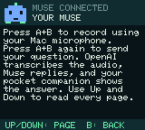

# Odd Retro Muse

Turn a ModRetro Chromatic into a pocket interface for your own Muse. A native Mac app supplies the keyboard and microphone; the handheld supplies the buttons, character, and screen.



The compact 160 × 144 interface keeps the little Muse character and gives replies 11 lines per page. Up/Down scroll through answers up to 2,400 ASCII bytes. Every delivered answer has 20 selectable next requests beneath it. The FPGA continues to run the cartridge underneath the custom MCU interface.

## Everyday use

Open **Odd Retro Muse.app** in your user Applications folder. It starts at login and stays in the menu bar when its window is closed. No terminal or browser is needed for everyday use.

1. Open Settings and enter your own OpenAI API key. The app stores it in macOS Keychain.
2. Click **Enable microphone** and allow Mac microphone access once. The app selects the built-in Mac microphone by default; use the microphone menu to choose another input.
3. Press **A+B together** on the Chromatic to start recording.
4. Press **A+B together again** to stop, transcribe with OpenAI, and send the text to Muse.
5. Press **B alone** while recording or transcribing to cancel. Once a question has been sent, it cannot be unsent.

You can also type in the app and press **Send to Muse**. A alone sends the selected handheld quick prompt; B returns to the prompt list. Press the side **Menu** button to show the Muse screen. Keep a game cartridge inserted for the stock FPGA display path.

Speak near the **Mac microphone**. The Chromatic headphone jack is output only. Your phone can stay closed after pairing. With the wireless bridge configured, USB is only needed for updates or power. The Mac must stay awake and connected to the same home network as the handheld; Muse and transcription require internet access. Closing the app window leaves it running. Choosing Quit stops microphone handling until the app is reopened. macOS login is needed after a computer restart.

## Twenty follow-up options

The gadget advertises a `display.reply` tool to Muse. It delivers the answer and exactly 20 distinct, contextual next requests in one call. Each option fits 44 ASCII characters so the full text is readable on two compact handheld lines. The Mac app lists all 20 below the current reply. Selecting one sends that request to Muse; it does not execute when the list appears.

On the handheld, press **A** while reading a reply to open its options, or press Down past the last page. Up/Down selects among all 20 numbered requests; **A** sends the selected one and **B** returns home. Up from the first option returns to the answer. **A+B** keeps its microphone controls.

The legacy `display.message` command still works and supplies 20 general follow-ups if Muse sends only text. New requests explicitly ask Muse to use `display.reply` and generate useful options for the specific answer. Both answer and options carry the current turn ID so a stale result cannot replace a newer turn. Invalid option counts, duplicates, overlong strings, or non-ASCII choices receive a tool error for correction.

This feature requires the updated handheld firmware and companion app. See VALIDATION.md for deployment status.

## Native Mac installation

Requires macOS 14 or later, Python 3.11+, and Xcode Command Line Tools (for Swift). Install those prerequisites from their official sources. The installer builds an app for the current Mac architecture, installs it under `~/Applications`, and registers two login agents for the app and its background bridge.

```sh
python3 -m venv .venv
.venv/bin/python -m pip install -r requirements.txt
# Provision the local wireless bridge once, with the already-flashed handheld on USB:
.venv/bin/python pair_wireless.py --port /dev/cu.YOUR_CHROMATIC --config work/wireless.json
.venv/bin/python install_companion.py --wireless-config work/wireless.json
```

For a computer that already has a wireless configuration installed, update using:

```sh
.venv/bin/python install_companion.py
```

The app uses OpenAI's `gpt-transcribe` file transcription API. Audio is recorded as mono PCM WAV at the selected microphone’s native sample rate, uploaded only after stop-and-send, and deleted locally when transcription finishes or fails. Cancellation aborts an active upload and prevents forwarding its result to Muse; audio already transmitted cannot be recalled. A two-minute recording limit cancels rather than sending an incomplete question. Transcripts above the handheld's 1,023-byte input limit remain in the app for editing.

OpenAI API billing is separate from ChatGPT subscriptions. Configure a valid API key with access and credit in the app's Settings. Keys do not pass through the local HTTP bridge, go onto the handheld, or enter this repository. Audio is sent to OpenAI and the transcript is sent to your Muse. Refer to [OpenAI's transcription documentation](https://developers.openai.com/api/docs/guides/speech-to-text) for service details.

The local bridge listens only on `127.0.0.1:8765`. Native requests use a matching loopback Origin. Local Wi-Fi packets use AES-256-GCM with fresh session challenges, sequence numbers, acknowledgements, retries, and duplicate suppression. The installation folder and wireless configuration are private to your Mac user. Keep `wireless.json` private.

```sh
.venv/bin/python install_companion.py --status
.venv/bin/python install_companion.py --uninstall
```

Uninstall removes these managed apps, login agents, and bridge files. It leaves the handheld firmware, Muse pairing, and OpenAI Keychain entry intact. The optional web page is a legacy debugging/typed-input interface; the installed native app provides the OpenAI microphone workflow.

## Handheld pairing

After installing the MCU firmware:

1. Power on with a cartridge inserted and press the side Menu button.
2. In the Muse phone app, open Settings → Devices and enable Developer mode.
3. Add `MuseGadget-Chromatic-…` and press A on the handheld when asked.
4. Supply your Wi-Fi credentials through Muse's encrypted setup.
5. Let the handheld restart and reconnect before using the Mac app.

Phone setup completion and live Muse connection are separate states. Check that the companion says connected. Your Muse must invoke the advertised `display.message` command with the current turn ID to deliver a reply. Delivery has a two-minute timeout. Replies are compact ASCII for the small pixel font; the app shows the same complete delivered text.

## Build the firmware

This port targets the **ESP32-U4WDH, 4 MB flash, no PSRAM** in the tested Chromatic. It uses ESP-IDF **v6.0.1**. Install that version and its ESP32 tools using Espressif's instructions. Store your Muse SDK token privately outside tracked source, for example `work/muse-sdk-token.txt`.

```sh
python3 build.py --idf /path/to/esp-idf \
  --token-file work/muse-sdk-token.txt --build-dir work/chromatic-build
```

`IDF_PATH` and `IDF_TOOLS_PATH` are also supported. Builds, sdkconfig, compiled firmware, backups, and token files must remain private: **the firmware embeds your Muse SDK token**. Do not distribute compiled handheld images.

### First flash versus app update

This is an experimental MCU firmware port, not an official ModRetro installer. Read the partition profile before flashing another device. Back up that device's entire 4 MB MCU flash privately before changing its partition layout. Do not substitute someone else's backup; it includes their settings and identity.

With ESP-IDF's Python environment active and the correct USB port selected:

```sh
python -m esptool --chip esp32 --port /dev/cu.YOUR_CHROMATIC \
  read-flash 0 0x400000 work/chromatic-stock-4mb.bin
# Record the checksum privately and retain the backup before proceeding.
shasum -a 256 work/chromatic-stock-4mb.bin
```

For a first installation, use the generated build's `flash_args` from its own build directory. It includes this port's bootloader, partition table, and application offsets:

```sh
cd work/chromatic-build
python -m esptool --chip esp32 --port /dev/cu.YOUR_CHROMATIC \
  --baud 115200 write-flash @flash_args
```

For a device already using this custom partition table, application-only updates preserve NVS pairing and the local wireless key:

```sh
python -m esptool --chip esp32 --port /dev/cu.YOUR_CHROMATIC \
  --baud 115200 write-flash 0x20000 work/chromatic-build/muse-gadget.bin
```

Restore stock only using the exact full backup made from that device. A full restore replaces its current MCU settings and pairing. This project does not update the FPGA, cartridge, or eFuses. The custom development profile omits stock manufacturing partitions and the second OTA slot, disables OTA and eFuse attestation, and stores pairing data in ordinary NVS. Only use the profile after understanding these differences.

## Source map and validation

- `macos/`: native SwiftUI app, microphone-only AVCaptureSession, microphone selection, Keychain, OpenAI multipart transcription, and background button handling.
- `companion.py`, `wireless_client.py`: loopback HTTP and authenticated Wi-Fi bridge.
- `sdk/esp32/main/chromatic_*.c`: compact character renderer, stock FPGA QSPI display, button chords, Muse turns, and local wireless transport.
- `sdk/esp32/devices/sdkconfig.chromatic`: board and development security profile.
- `sdk/esp32/partitions_chromatic.csv`: custom MCU flash layout.

See [VALIDATION.md](VALIDATION.md) for what was actually checked and the remaining credential-dependent voice test.

Based on Meta's [Muse Gadgets SDK](https://github.com/facebookincubator/muse-gadget-sdk) and protocol references from ModRetro's [MCU source](https://github.com/ModRetro/oss-chromatic-console-mcu). Original source notices and Apache 2.0 licensing are preserved. This is an independent project.

Read [SECURITY.md](SECURITY.md) for credential handling, the public SDK development key, and the development firmware's physical-security limitations.
